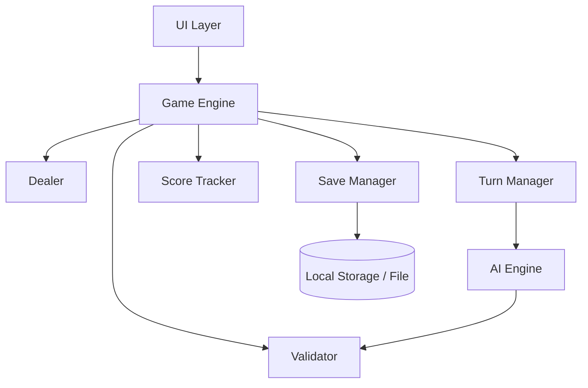

# Tài Liệu Thiết Kế Kỹ Thuật: Game Sâm 10 Lá

## Tổng Quan

Game Sâm 10 lá là trò chơi bài dân gian Việt Nam cho 2–4 người chơi (người thật hoặc bot AI). Mỗi người được chia 10 lá từ bộ bài 52 lá tiêu chuẩn. Người hết bài trước thắng ván. Game tích lũy điểm phạt qua nhiều ván; người đạt ngưỡng 30 điểm phạt thì thua toàn bộ game.

Hệ thống được thiết kế theo kiến trúc phân lớp rõ ràng: lớp logic game thuần túy (không phụ thuộc UI), lớp AI, lớp lưu trữ, và lớp giao diện. Điều này giúp dễ kiểm thử và mở rộng.

---

## Kiến Trúc



### Các Lớp Chính

- **UI Layer**: Hiển thị trạng thái game, nhận input từ người dùng.
- **Game Engine**: Điều phối toàn bộ luồng game, là trung tâm kết nối các thành phần.
- **Dealer**: Xáo bài và chia bài.
- **Validator**: Kiểm tra tính hợp lệ của Combination và so sánh độ lớn.
- **Turn Manager**: Quản lý thứ tự lượt, đồng hồ đếm ngược, trạng thái Pass.
- **Score Tracker**: Tính điểm phạt sau mỗi ván, phát hiện Cóng, Thối 2, Báo Sâm.
- **AI Engine**: Điều khiển logic đánh bài của Bot.
- **Save Manager**: Lưu và tải trạng thái game.

---

## Các Thành Phần và Giao Diện

### Dealer

```typescript
interface Dealer {
  shuffle(deck: Card[]): Card[];
  deal(deck: Card[], playerCount: number, cardsPerPlayer: number): Hand[];
}
```

- Dùng Fisher-Yates shuffle để đảm bảo phân phối ngẫu nhiên đều.
- Chia đúng 10 lá cho mỗi người chơi.

### Validator

```typescript
interface Validator {
  // Kiểm tra một tổ hợp lá bài có phải Combination hợp lệ không
  isValidCombination(cards: Card[]): ValidationResult;

  // Kiểm tra combination mới có thể đánh đè lên pile không
  canBeat(incoming: Combination, pile: Combination): boolean;

  // Xác định loại Combination
  getCombinationType(cards: Card[]): CombinationType | null;
}

type CombinationType = 'RAC' | 'DOI' | 'SAM' | 'TU_QUY' | 'SANH';

interface ValidationResult {
  valid: boolean;
  reason?: string;
  combination?: Combination;
}
```

**Quy tắc so sánh:**
- Rác, Đôi, Sám, Tứ Quý: so sánh theo Rank của lá (hoặc nhóm lá).
- Sảnh: so sánh theo Rank của lá cao nhất trong chuỗi.
- Tứ Quý chặt được: 1 lá 2 đơn, Đôi 2.
- 3 Đôi liên tiếp (6 lá) chặt được 1 lá 2 đơn.
- Chỉ so sánh cùng loại Combination (trừ các luật đặc biệt trên).

### Turn Manager

```typescript
interface TurnManager {
  getCurrentPlayer(): Player;
  nextTurn(): void;
  recordPass(playerId: string): void;
  isAllPassed(): boolean; // tất cả player còn lại đều pass
  resetPile(): void;
  startTimer(onTimeout: () => void): void;
  stopTimer(): void;
}
```

- Thứ tự lượt theo chiều kim đồng hồ.
- Đồng hồ 30 giây; hết giờ tự động Pass.
- Khi tất cả còn lại đều Pass → xóa Pile, người vừa đánh được đánh tự do.

### Score Tracker

```typescript
interface ScoreTracker {
  calculatePenalty(player: Player, winner: Player): PenaltyResult;
  isConged(player: Player, roundHistory: RoundHistory): boolean;
  isThoi2(player: Player): boolean;
  applyBaoSamBonus(winner: Player, losers: Player[]): void;
  applyBaoSamPenalty(baoSamPlayer: Player): void;
  getTotalScore(playerId: string): number;
  isGameOver(threshold?: number): boolean;
}

interface PenaltyResult {
  playerId: string;
  basePoints: number;   // 1 điểm/lá thường
  thoi2Points: number;  // 2 điểm/lá 2 (nếu Thối 2)
  congMultiplier: number; // nhân đôi nếu Cóng
  total: number;
  flags: ('CONG' | 'THOI_2' | 'BAO_SAM_PENALTY')[];
}
```

**Quy tắc tính điểm phạt:**
- Mỗi lá thường còn lại: 1 điểm.
- Thối 2 (toàn bộ hand còn lại là lá 2): mỗi lá 2 tính 2 điểm.
- Cóng (không đánh được lá nào): nhân đôi tổng điểm phạt.
- Ngưỡng thua: 30 điểm tích lũy.

### AI Engine

```typescript
interface AIEngine {
  chooseAction(
    hand: Hand,
    pile: Combination | null,
    gameState: GameState,
    difficulty: 'EASY' | 'HARD'
  ): AIAction;
}

type AIAction =
  | { type: 'PLAY'; combination: Combination }
  | { type: 'PASS' };
```

**Chiến lược AI:**
- Easy: Chọn Combination hợp lệ nhỏ nhất có thể thắng Pile.
- Hard: Theo dõi lá đã đánh, ưu tiên giữ bài mạnh, đánh bài yếu trước.
- Thời gian phản hồi: ≤ 1 giây.

### Save Manager

```typescript
interface SaveManager {
  save(state: GameState): void;
  load(): GameState | null;
  clear(): void;
  isValid(state: unknown): state is GameState;
}
```

- Lưu vào localStorage (web) hoặc file JSON (native).
- Validate schema trước khi load; nếu lỗi → trả về null → bắt đầu ván mới.

---

## Mô Hình Dữ Liệu

### Card

```typescript
type Suit = 'SPADE' | 'HEART' | 'DIAMOND' | 'CLUB'; // Bích, Cơ, Rô, Nhép
type Rank = 3 | 4 | 5 | 6 | 7 | 8 | 9 | 10 | 11 | 12 | 13 | 14 | 15;
// 11=J, 12=Q, 13=K, 14=A, 15=2 (lá 2 là lớn nhất)

interface Card {
  rank: Rank;
  suit: Suit;
}
```

> Lá 2 được biểu diễn bằng rank=15 để so sánh tự nhiên. Chất không ảnh hưởng độ lớn.

### Combination

```typescript
interface Combination {
  type: CombinationType;
  cards: Card[];
  // Rank đại diện để so sánh (rank của lá cao nhất với Sảnh, rank chung với Đôi/Sám/Tứ Quý)
  representativeRank: Rank;
}
```

### Player

```typescript
interface Player {
  id: string;
  name: string;
  isBot: boolean;
  difficulty?: 'EASY' | 'HARD';
  hand: Card[];
  hasPlayedThisRound: boolean; // để phát hiện Cóng
}
```

### GameState

```typescript
interface GameState {
  players: Player[];
  currentPlayerIndex: number;
  pile: Combination | null;
  roundNumber: number;
  scores: Record<string, number>; // playerId -> tổng điểm phạt tích lũy
  passedPlayers: Set<string>;     // playerId đã pass trong lượt hiện tại
  baoSamPlayerId: string | null;
  roundHistory: RoundHistory;
  gameOver: boolean;
  winner: string | null;          // playerId thắng toàn game
}

interface RoundHistory {
  roundNumber: number;
  playActions: PlayAction[];      // lịch sử hành động trong ván
  roundWinner: string | null;
}

interface PlayAction {
  playerId: string;
  action: 'PLAY' | 'PASS' | 'BAO_SAM';
  combination?: Combination;
  timestamp: number;
}
```

---

## Correctness Properties

*A property is a characteristic or behavior that should hold true across all valid executions of a system — essentially, a formal statement about what the system should do. Properties serve as the bridge between human-readable specifications and machine-verifiable correctness guarantees.*


### Property 1: Shuffle giữ nguyên bộ bài

*For any* bộ bài 52 lá, sau khi xáo bài, bộ bài kết quả phải chứa đúng các lá bài giống hệt bộ ban đầu (cùng multiset), không thêm không bớt.

**Validates: Requirements 1.2**

---

### Property 2: Chia bài đúng số lượng và không trùng lặp

*For any* số lượng người chơi hợp lệ (2–4), sau khi chia bài, mỗi người chơi có đúng 10 lá, tổng số lá được chia bằng playerCount × 10, và không có lá nào xuất hiện ở hai tay bài khác nhau.

**Validates: Requirements 1.3**

---

### Property 3: Người thắng ván trước đánh trước ván sau

*For any* người chơi thắng một ván, ván tiếp theo phải bắt đầu với người chơi đó là người đánh đầu tiên.

**Validates: Requirements 1.5**

---

### Property 4: Validator chấp nhận mọi Combination hợp lệ

*For any* tập hợp lá bài tạo thành Rác, Đôi, Sám, Tứ Quý, hoặc Sảnh hợp lệ theo luật, `isValidCombination` phải trả về `valid: true`.

**Validates: Requirements 2.1**

---

### Property 5: Sảnh với lá 2 — chấp nhận khi liên tiếp, từ chối khi không liên tiếp

*For any* chuỗi lá bài có chứa lá 2: nếu lá 2 nằm trong chuỗi Rank liên tiếp tự nhiên (ví dụ A-2-3, 2-3-4) thì Validator chấp nhận; nếu lá 2 không nằm trong chuỗi liên tiếp thì Validator từ chối.

**Validates: Requirements 2.2**

---

### Property 6: canBeat — chỉ thắng khi cùng loại và Rank cao hơn (trừ luật đặc biệt)

*For any* hai Combination cùng loại (CombinationType), `canBeat(incoming, pile)` trả về `true` khi và chỉ khi `incoming.representativeRank > pile.representativeRank`. *For any* hai Combination khác loại (không thuộc các luật đặc biệt), `canBeat` trả về `false`.

**Validates: Requirements 2.3, 2.4, 2.5**

---

### Property 7: Pile trống — mọi Combination hợp lệ đều được đánh

*For any* Combination hợp lệ, khi Pile là null (trống), `canBeat(combo, null)` phải trả về `true`.

**Validates: Requirements 2.7**

---

### Property 8: Đánh bài hợp lệ cập nhật Pile và chuyển lượt

*For any* trạng thái game và Combination hợp lệ được đánh, sau khi xử lý: Pile phải bằng Combination vừa đánh, và `currentPlayerIndex` phải chuyển sang người tiếp theo theo chiều kim đồng hồ.

**Validates: Requirements 3.2**

---

### Property 9: Tất cả Pass → Pile reset

*For any* trạng thái game, khi tất cả người chơi còn lại (không phải người vừa đánh) đều Pass, Pile phải được reset về null và người vừa đánh được đánh tự do.

**Validates: Requirements 3.4**

---

### Property 10: Hết bài → thắng ván

*For any* người chơi đánh lá bài cuối cùng trong tay, `roundWinner` phải được gán là người chơi đó.

**Validates: Requirements 4.1**

---

### Property 11: Tính điểm phạt đúng công thức

*For any* tay bài còn lại của người thua: nếu không phải Thối 2, mỗi lá tính 1 điểm; nếu là Thối 2 (toàn bộ là lá 2), mỗi lá 2 tính 2 điểm. Tổng điểm phạt phải bằng đúng công thức này.

**Validates: Requirements 4.2, 4.3, 4.4, 7.2**

---

### Property 12: Game kết thúc khi đạt ngưỡng 30 điểm

*For any* cập nhật điểm, `isGameOver()` trả về `true` khi và chỉ khi có ít nhất một người chơi có tổng điểm phạt tích lũy ≥ 30.

**Validates: Requirements 4.5**

---

### Property 13: Báo Sâm — chỉ người Báo Sâm được đánh

*For any* trạng thái game có `baoSamPlayerId` được đặt, chỉ người chơi đó mới có thể thực hiện hành động PLAY; các người chơi khác không thể đánh bài.

**Validates: Requirements 5.2**

---

### Property 14: Báo Sâm bị chặn → reset trạng thái

*For any* trạng thái game đang Báo Sâm, khi có người chặn được bài, `baoSamPlayerId` phải được reset về null và game tiếp tục theo luật thông thường.

**Validates: Requirements 5.5**

---

### Property 15: Phát hiện Cóng chính xác

*For any* lịch sử ván đấu, `isConged(player)` trả về `true` khi và chỉ khi người chơi đó không có bất kỳ hành động PLAY nào trong `roundHistory.playActions`.

**Validates: Requirements 6.2**

---

### Property 16: Phạt Cóng nặng hơn phạt thường

*For any* người chơi bị Cóng, tổng điểm phạt của họ phải lớn hơn điểm phạt của người chơi không bị Cóng với cùng tay bài còn lại.

**Validates: Requirements 6.3**

---

### Property 17: Phát hiện Thối 2 chính xác

*For any* tay bài còn lại, `isThoi2(player)` trả về `true` khi và chỉ khi tất cả các lá trong tay đều có rank = 15 (lá 2); trả về `false` nếu có ít nhất một lá không phải lá 2.

**Validates: Requirements 7.2, 7.3**

---

### Property 18: AI luôn trả về hành động hợp lệ

*For any* trạng thái game hợp lệ, `AI_Engine.chooseAction()` phải trả về một trong hai: hành động PLAY với Combination hợp lệ có thể đánh lên Pile hiện tại, hoặc hành động PASS.

**Validates: Requirements 8.2, 8.3**

---

### Property 19: Easy AI chọn Combination nhỏ nhất hợp lệ

*For any* tay bài của Easy AI và Pile hiện tại, nếu có Combination hợp lệ, AI phải chọn Combination có `representativeRank` nhỏ nhất trong số tất cả Combination hợp lệ có thể đánh.

**Validates: Requirements 8.4**

---

### Property 20: Save/Load round-trip giữ nguyên trạng thái

*For any* `GameState` hợp lệ, sau khi lưu rồi tải lại, trạng thái kết quả phải tương đương với trạng thái ban đầu (cùng Hand, Pile, Turn, điểm tích lũy).

**Validates: Requirements 10.2, 10.3**

---

## Xử Lý Lỗi

### Lỗi Validation Đầu Vào
- Số lượng người chơi ngoài khoảng [2, 4]: hiển thị thông báo lỗi, không bắt đầu ván.
- Combination không hợp lệ: Validator từ chối, UI hiển thị lỗi trong 500ms, người chơi chọn lại.
- Đánh bài không đúng lượt: bỏ qua hành động.

### Lỗi Dữ Liệu Lưu Trữ
- Dữ liệu lưu bị lỗi/không hợp lệ: `SaveManager.load()` trả về null, Game Engine bắt đầu ván mới.
- Lỗi ghi file/localStorage: log lỗi, tiếp tục game (không crash).

### Lỗi AI
- AI không trả về hành động trong 1 giây: tự động Pass.
- AI trả về Combination không hợp lệ: fallback về Pass.

### Timeout
- Người chơi không hành động trong 30 giây: tự động Pass, chuyển lượt.

---

## Chiến Lược Kiểm Thử

### Công Cụ

- **Unit/Property tests**: [fast-check](https://github.com/dubzzz/fast-check) (TypeScript/JavaScript) — thư viện property-based testing.
- **Unit tests**: Vitest hoặc Jest.
- Mỗi property test chạy tối thiểu **100 iterations**.

### Phân Lớp Kiểm Thử

**Unit Tests (example-based)**
- Các luật đặc biệt: Tứ Quý chặt lá 2, 3 Đôi liên tiếp chặt lá 2.
- Báo Sâm: thưởng/phạt đặc biệt.
- Timeout auto-pass.
- Khởi tạo game với số lượng người chơi không hợp lệ.
- Load dữ liệu lưu bị lỗi.

**Property Tests (fast-check)**
- Mỗi Correctness Property ở trên được implement bằng 1 property test.
- Tag format: `// Feature: sam-10-la-card-game, Property {N}: {property_text}`
- Ví dụ:
  ```typescript
  // Feature: sam-10-la-card-game, Property 1: Shuffle giữ nguyên bộ bài
  test('shuffle preserves deck', () => {
    fc.assert(fc.property(fc.array(cardArbitrary, { minLength: 52, maxLength: 52 }), (deck) => {
      const shuffled = dealer.shuffle(deck);
      expect(sortCards(shuffled)).toEqual(sortCards(deck));
    }), { numRuns: 100 });
  });
  ```

**Integration Tests**
- Luồng game đầy đủ: từ khởi tạo → đánh bài → kết thúc ván → tính điểm.
- Save/Load với trạng thái game thực tế.
- AI hoàn thành lượt trong thời gian quy định.

**Smoke Tests**
- Game khởi động thành công.
- UI hiển thị đúng các thông báo (Cóng, Thối 2, kết quả ván).
- Đồng hồ đếm ngược hiển thị trong lượt người chơi.
